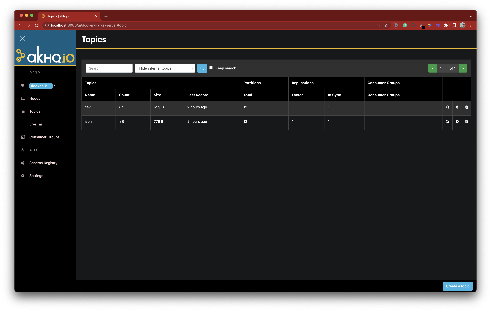

# We're hiring a QA Engineers! 👨‍💻 👩‍💻

We're hiring QA Engineers experimented with TypeScript to help us make amazing products.

## 1. The Application Process

Please read this if you want to apply: [How our Application process works?](../application-process.md). This is necessary to ensure your application process will be smooth.

## 2. The Challenge

You'll write some e2e tests for [AKHQ](https://akhq.io/), a tool similar to our product.

To run AKHQ locally on you're computer, we're providing you two scripts, `start_akhq.sh` and `stop_akhq.sh`.    
You'll need to have installed [Docker](https://www.docker.com/products/docker-desktop/) first on your computer to run these scripts.

To start AKHQ,
- run `./start_akhq.sh`
- wait for a few seconds (it can be slow) 
- in your browser, goes to `localhost:8080`.    
  You should see something like this: 

We ask you to write 3 e2e tests for AKHQ.

### Constraints

1. You must your tests with TypeScript and with [Playwright](https://www.playwright.dev/).
2. Your code must be committed to a private repository on GitHub.     

### Test 1 - Show hidden topics

On the "Topics" page, when the user selects "Show all topics" in the dropdown list present in the filters of the table and then clicks on the "Search" button, 
the table should at least show 2 additional lines. 
One of the additional lines must contain `__consumer_offsets` as the Topic name.
The other additional line must contain `___schemas` as the Topic name.

### Test 2 - Create a topic

From the "Topics" page, the user can create a new Topic via the "Create a topic" button.
Write a test suite validating that creating a Topic works in AKHQ.

### Test 3 - Live Trail

AKHQ is a nice interface on top of [Apache Kafka](https://kafka.apache.org/).

Kafka is a kind of letter box where some programs will publish messages into (it's called "producing"), and some other programs will wait for and read these messages when they arrive (it's called "consuming").
Once a message is produced, the programs waiting for it will do receive it and do something with it.

Messages are sent in things called "topics" so that some programs can consume from some topics while some other programs will consume from other topics.

AKHQ has a "Live Trail" feature that allows you to consume from a Topic in live.
You tell AKHQ which Topic to consume from, and it'll start to wait for messages published in that Topic.
Once a message is published in that Topic, AKHQ will show it in the UI.

We ask you to write a test suite proving that the Live Trail feature works.
Your test must create a new Topic, start the Live Trail on this new Topic, then produce a message in that Topic and finally validate that the message you produced has been read by the Live Trail you started previously.
