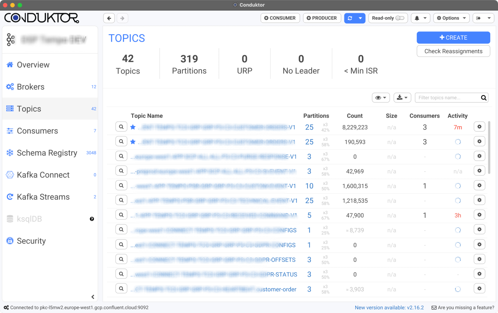

# We're hiring a UI/UX Designer! 👨‍💻 👩‍💻

Don't hesitate to do the challenges presented here and tell us: jobs@conduktor.io!

We're hiring a UI/UX Designer experimented with Figma to help us making a great UI and improve the UX.

# 1. The Job requirements

Please confirm that you fit our position: [UI/UX Designer](https://apply.workable.com/conduktor/j/5885E70C9B/).

# 2. The Application Process

Please read this if you want to apply: [How our Application process works?](../application-process.md).

This is necessary to ensure your application process will be smooth.

# 3. The Challenge

Conduktor is a software company centered around Apache Kafka.
Apache Kafka is _basically_ a message broker. It forms a _cluster_ composed of many _topics_ containing _data_. Any application can send data to Apache Kafka, and other applications can "listen" to these incoming data.

## Requirements: Rethink one of our main screen

We'd like you to look at the following screenshot of our software and tell us what would you improve and how.

You must think from:

- a UX perspective: prepare some questions you would ask us like if you were working with us
- a UI perspective: prepare a Figma design to see how you would rework the existing screen

## The screen to rethink

Here, Conduktor shows you some directions, the list of topics and some metrics.

